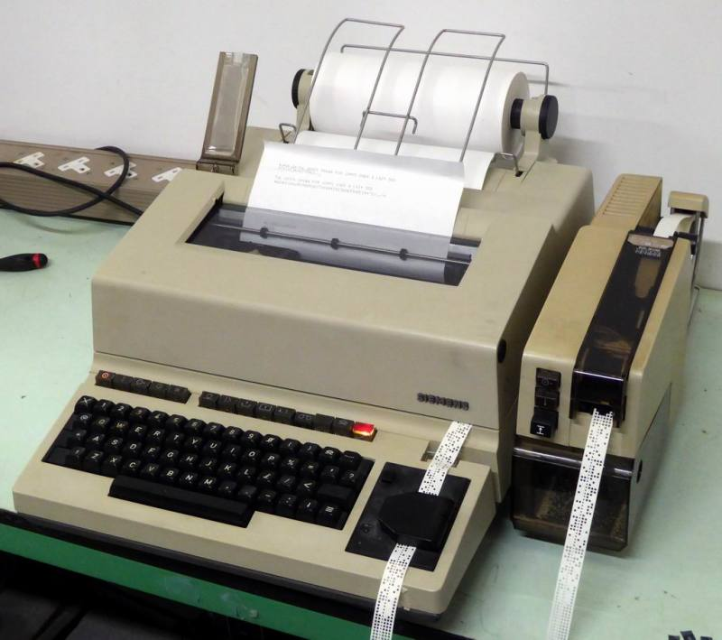

# Better Living with VIM

---

 

<!-- This presentation powered by vim and marp -->

----

# Timeline

- 1976: First release of Vi
- 1976: First Emacs release
- 1991: First release of Vim 
- 2005: My greybeard unix teacher told me to learn Vi(m)
- 2014: Neovim
- 2021: This amazing presentation

<!--
---

# Why?

- Invented for use with teleprinters
- Combined existing unix tools

-->

---

## VIM on the Server

## Vim as an IDE

## Package Management

## Navigation

---

## Navigation: Tabs

<!-- TODO: some joke about me vs Tabs? -->

<!-- 

Don't use tabs if you don't know what you are doing, and if you know what
you are doing, then you won't use tabs.

-->

---

## Navigation: Buffers

---

# Attribution

- Some icons made by [Freepik](https://www.freepik.com)
