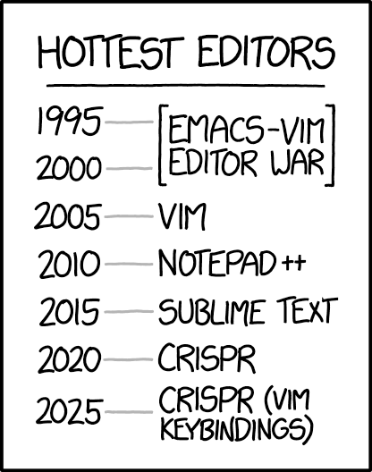
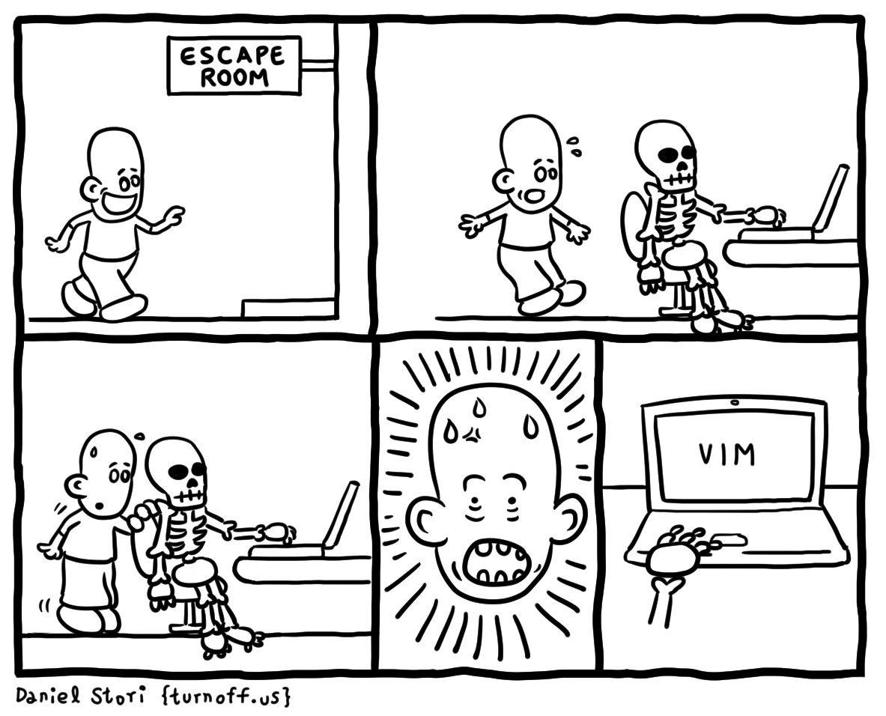
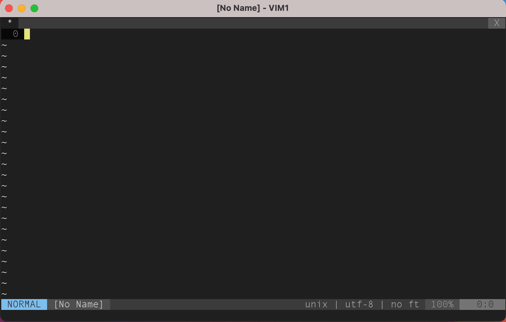
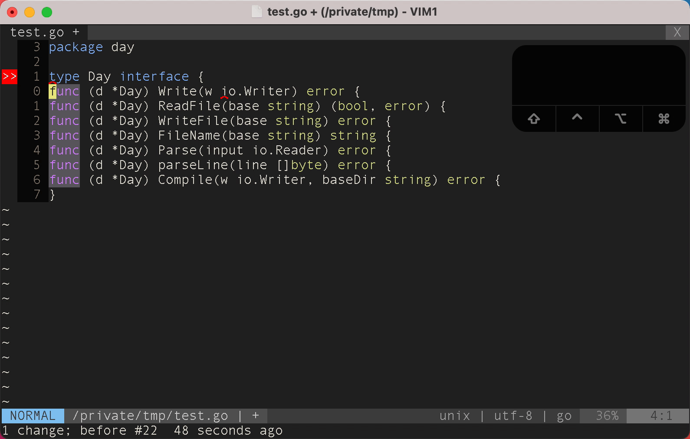
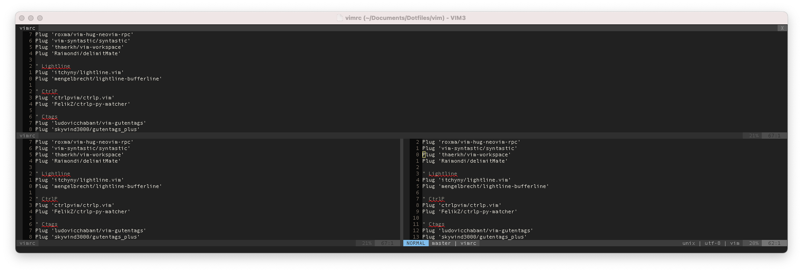

# Better Living with VIM

Tabitha Rollins
Engineer with Cloud Networking Team @ Elastic
2021 / 05 / 19



---

# Who am I

- Engineer on Cloud Networking
- Elastician since March 8th
- Using VIM since 2004

---

  

<!-- This presentation powered by vim and marp -->

---

# Why this Presentation?



<!--

- Inspiration
- Comfort
- The unknown unknowns

-->

---

# Why do I use VIM

<!-- 

* Muscle Memory
* Using other editors feels like walking through molasses 
* Flexible
* Available on the server and locally
* Strengthens general unix tools (columns, sed, grep, etc)

-->

---

## :help help



---

## :help help

- tab complete help commands
- help files are interlinked (see tags)

<!--

Official VIM is well documented along with most major plugins.

-->

---

## :help tags

- `ctrl-o`: Jump to previous cursor position
- `ctrl-i`: Jump to next cursor position
- `ctrl-]`: Jump to tag of word under cursor

<!--

* work both for 
-->

---

## Screen Movement

- `ctrl-e`: scroll down one line
- `ctrl-d`: scroll down one screen's worth
- `ctrl-u`: jump one screen up
- `ctrl-y`: scroll up one line
- `zz`: center screen on current line
- `zt`: center current line at top of the screen
- `zb`: center current line at bottom of the screen

---

## grep

- `:%g/RE/p`
- `:%v/func/d`

### With Shift-V (Visual-Line Mode)

- `:'<,'>g/RE/p`
- `:'<,'>` will be auto-populated

---

## :help filter

```
foo
bar
foo
baz
foo
```

---

## :help filter

```
:%!sort | uniq -c
```

---

## :help filter


```
   1 bar
   1 baz
   3 foo
```

---

## :help filter bonus tricks!

```
:%!jq .
```

```
:%!sudo tee %
```

---

## :help registers

- Like a CPU
  - Used to store data (copy / paste)
  - Used to store programs (macros)
- `"ayy`: copy current line `yy`, into register `"a`
- `"ap`: paste register `"a`
- `"%`: The name of the current file
- `"/`: What you last searched for
- `"+`: System Clipboard

<!--
* With a properly compiled vim "+ maps to the system clipboard
-->

---

## :help recording (a.k.a. Macros)

- A list of key presses stored in a register
- Recorded with `q<register>` e.g. `qa`, `q0`
- Used via `@<register>` e.g. `@a`
- Macros can include macros

<!-- Because macros are just registers full of keypresses you can paste the
register edit, and then recopy it -->

---

## :help recording



---

## :help tabs

<!-- TODO: some joke about me vs Tabs? -->


<!-- 

Don't use tabs if you don't know what you are doing, and if you know what
you are doing, then you won't use tabs.

The quick summary is that they work around the concept of a collection of
windows, and not documents.

-->

---

## :help buffer


---

## :help buffer

- Supports splits (:help vsplit, :help split)
- Addons like `lightline-bufferline`, `minibufexpl` look like tabs
- `:b` provides tab completion switching

---

## :help split & :help vsplit




---

## :help split & :help vsplit

- `ctrl-w s` & `ctrl-w v` create split and vsplit respectively
- `ctrl-w c` close current pane
- `ctrl-w <hjkl>` navigate between panes
- `ctrl-w +`, `ctrl-w -` increase/decrease current pane length
- `ctrl-w 10 +` increase current pane by 10 lines
- `ctrl-w >`, `ctrl-w <` increase/decrease current pane width
- `ctrl-w =` best effort at equalising all panes

---

## Package Management

- Plug
- Vundle
- Pathogen

---

### Plug


```
" Go
Plug 'sebdah/vim-delve'
Plug 'fatih/vim-go', { 'tag': '*' }
" Run :PlugInstall from vim
```

### Pathogen

```
git clone git@github.com:tpope/vim-fugitive.git ~/.vim/bundle/vim-fugitive
```

---

## Typing Completion

- [deoplete](https://github.com/Shougo/deoplete.nvim) and **L**anguage **S**erver **P**rotocol.

---

## Quick Opening Files

- [fzf](https://github.com/junegunn/fzf) and [fzf-vim](https://github.com/junegunn/fzf.vim)
- Better caching coming to a slack channel near you soon

<!-- 
---

## Developing Scala

**Disclaimer: I'm not a scala dev**
-->

---

# References

- My Dotfiles: [github.com/keyneston/vimrc](https://github.com/keyneston/vimrc)
- This presentation: [github.com/keyneston/presentations/better-living-with-vim](https://github.com/keyneston/presentations/tree/main/better-living-with-vim)
- @tabitha or #vim on Slack
